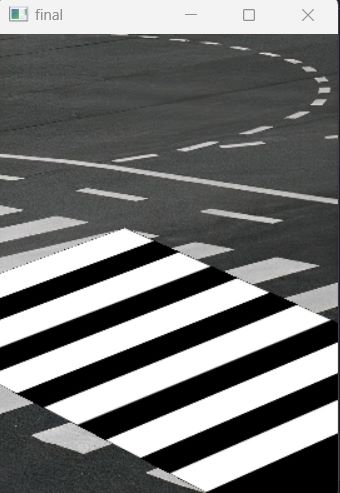

 # Documentation Zebra Crossing Image Detection 

Main stages in the development of the project:
1.Edge detection.
2.Affine 3D transformation.
3.Finding the crossroad's projection with RANSAC.
4.Displaying the projection/bounding box in the original image.

### ***I.Edge detection***
In order to accomplish the edge detection, we used Canny Edge Detection.

### **Process**
***
#### **I.I**  Gaussian filter
Before applying Canny edge detection algorithm we applied a **Gaussian filter** to smooth the image in order to remove the noise.


```GaussianBlur(src, dst, ksize = Size(5, 5), sigmaX = 1.4, sigmaY = 1.4);```

We used a **Gaussian kernel of size 5**, giving the best results. 
- for a Gaussian kernel of **size 3** => *not blurred enough*


- for a Gaussian kernel **size = 5**  => *optimal amount of blurry*


For the Sigma value, we used a generic one **(1.4)** as there weren't many differences with different values.

#### **I.II** Applying Canny 

```Canny(gauss, dst, 100, 60, 3);```

##### ***Choosing an optimal Threshold***
- in order to choose the best value for the threshold we used a **Trackbar** 
Usage examples:
    1. ***t < 35*** => too much noise
    


   2.  ***35 < t < 55***  => good results
    


  3.  ***t > 60*** => misses important information
    

    
Considering this information we choose a threshold equal to **53**, an average value.

#### ***II. Affine 3D transformation.***
- we applied those transformation on the ***ideal crossroad***, so that the orientation of the crossroad will match the one in the sourse image.


>Disadvantage: considering the fact that the affine traansformation function has only 3 parameters, and the crossroad is a quadrilateral, the transformation was always symmetrical, which was not a wanted output
#### Affine Output:


#### ***II.I. Perspective 3D transformation.***
- a better solution is using perspective transformation

>Avantage: the perspective transformation has 4 paramaters, fact that solves our previous problem with symmetry
#### Perspective Output:


#### ***III. Root mean square error***
- after computing the transformation matrix for every posibility, one way of finding the best match would be using Root mean square error as the difference between each to pixels 


##### Output of the best transformation matrix  :
...


#### ***IV. Finding the crossroad's projection with RANSAC.***

For the Ransac algorithm we used 2 approaches:

**1. Distance between points**

**2. Liniar Regression**

#### IV.I. Distance between points
- for the first approach we process all points from the canny transformed image and select 2 random points that will compute the line
- we traverse all the other points and we only keep the ones that are positioned at specific distance from the line, set by a **threshold = 1**
> **Choosing the threshold**
> 1.  threshold < 1 - removes too many lines (ex: 0.3)

 
> 2. threshold = 1 - good output
> 3. threshold > 1 - adds lines that should't be there (ex: 1.5)


For ransac we choose a number of 100.000 maximum iterations.
> **Choosing the number of maximum iterations**
>1.  iterations < 10.000 - loses lines
>2.  10.000 < iterations < 100.000 - slightly different
>3.  100.000 < iterations  - takes too much time to compute

Also, we set a threshold of **100 for the number of inliners**.
> **Choosing the number of inliners**
>1.  500 < inlines - no lines detected 
>2.  inliners = 100 - good results
>3.  inliners < 50 - too many lines that aren't part of the actual crossroad


 > Final output for distance heuristic:
 #### Final Output:
 
 
 
 #### **IV.II. Liniar Regression**

 ```
 This method is considerably less effective cosidering the fact that the best fitting line 
 is a line that is closest to every point. It is an approximation of the actual line. Here 
 comes the risk that the line detected WON'T MATCH ANY OF THE ACTUAL LINES, being only 
 an approximation of it.
 ```
Within this algorithm we computed the best fitting line in the form of y = ax + b, where a is the slope of the line and b is the constant term using this formula. The model tries to find the line of best fit during training using this formula:


```
During the development of this method we encountered a difficulty for horizontal lines, this 
algoritm being developed only for the other types of lines.
```
#### Output without solution:

 

**Solution:**
Checking point "horizontaly" by comparing the **standard deviations** of X and Y values.
> stDevX = StandardDeviation(xValues) 
> stDevY = StandardDeviation(yValues) 

If horizontal (StandardDeviation == 0) , regress a line through **inverted Y and X point**. 
And instead of using **y = ax + b** formula we used  **x = ay + b**.

#### Output with solution:

 


#### Final Output:

 

#### ***V. Finding the crossroad's projection with Houghlines.***
**V.I. Using crossroad's corners**

>Avantage: this method is very efficient considering the output.

>Disadvantage: the crossroad's corners are hardcoded.

####  Output:


 


**V.II. Sorting the lines**
- we sort the lines in the ideal crossroad image
- we sort the outputed lines by the Houghlines algorithm 
- then we extract the first and the last line from the2 sorted arrays

>Avantage: this method does't depend on the way the crossroad is arranged, as we sort the lines,
giving us the favorable results


####  Output:


> As the visual representations show, we preceded to continue developing this algorithm using  Houghlines as it has more accurate and stable results, even if Ranasac performs better on most data sets.

 #### ***VI. Vanishing Point Detection***

 - in order to reduce the noise of the image and to keep only the crossroad's lines, we used the vanishing point detection which filters all lines in the canny output and keeps only parallel lines
 - the vanishing point is approximately the point of intersection of these lines
 
##### Output before applying Vanishing Point Detection:


##### Output after applying Vanishing Point Detection:


 #### ***VII.Displaying the projection/bounding box in the original image.***
 - for the last part of the algorthm we used a white mask on which we applied the transformation matrix
 - thus mask allows us to focus only on the portions of the image that interests us, the crossroad
 - afterwards, in the source image, at the position where the white mask is located, we display the transformed ideal crossroad 

##### White Mask Output:


##### Final Output:


